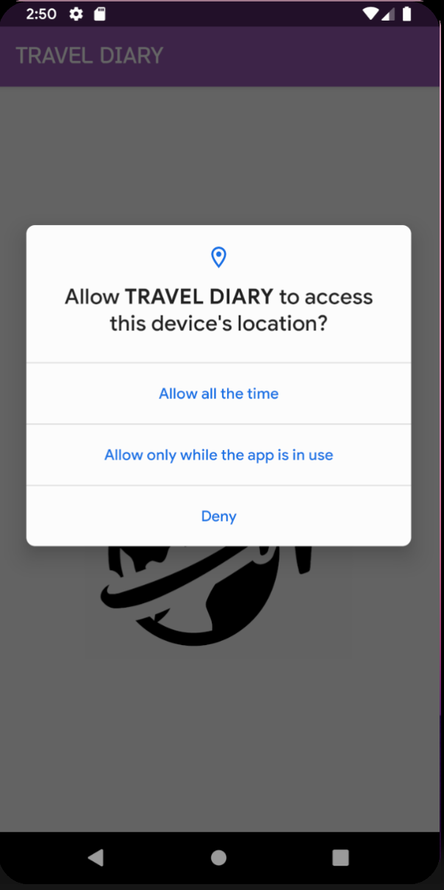
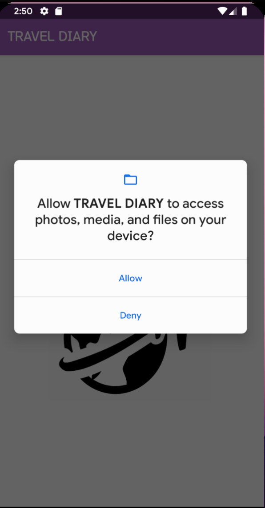
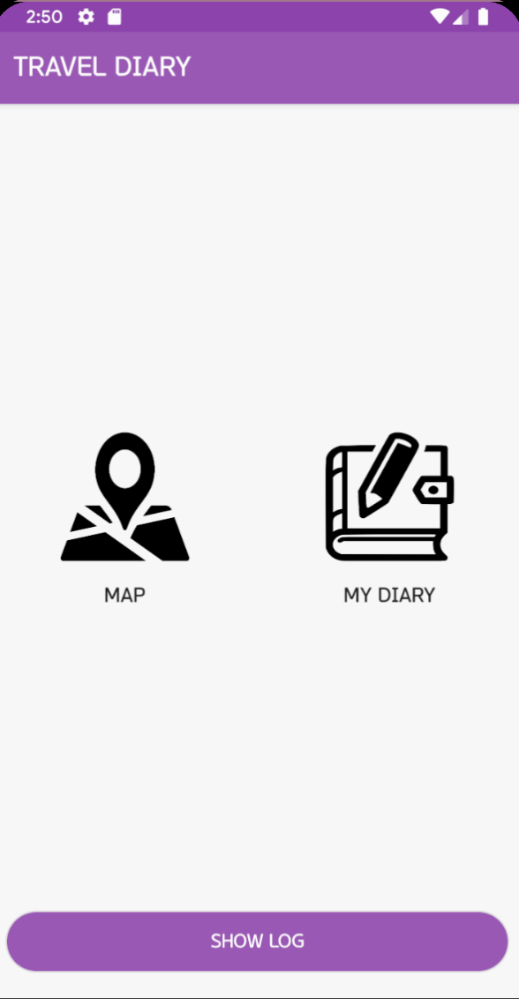
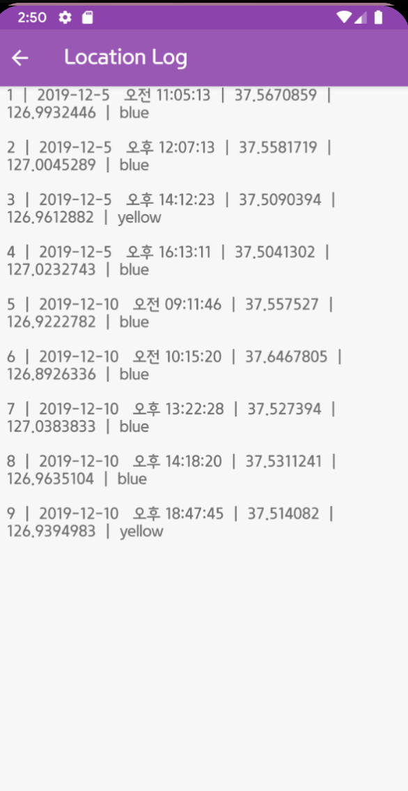
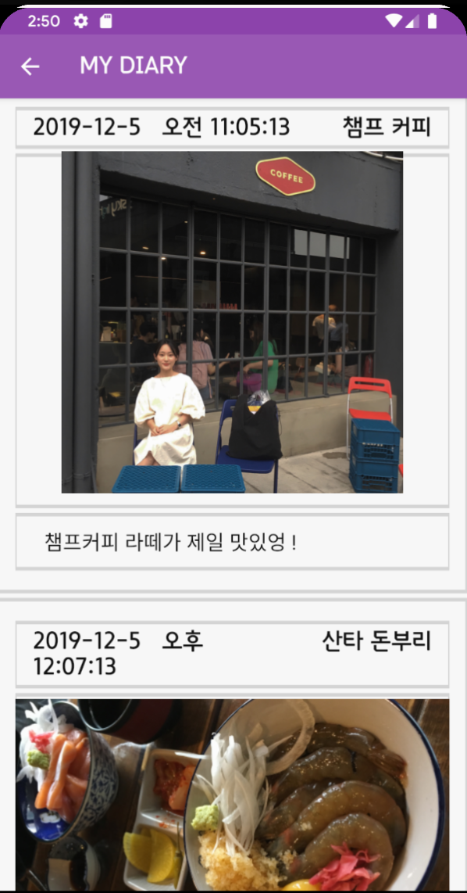

# 여행 다이어리 애플리케이션
 1시간 주기로 사용자의 위치를 기록하고, 해당 위치에 다이어리를 작성하는 여행자를 위한 애플리케이션

## 개발 동기

## 결과
</img>
</img>
</img>
</img>
</img>
</img> 

## 주 기능
* 지도
* 일기
* 캘린더

### 지도
* 1시간 간격으로 트래킹 한 위치를 노란색 마커로 표시
* 현재 위치는 빨간색 마커로 표시
* 노란핀/빨간핀 클릭시 -> 기록 또는 휴지통 기능 선택
* 다이어리 저장 시 -> 파란색 마커로 업데이트

### 일기
* 갤러리/카메라와 연동하여 사진 등록
* 장소명
* 날짜/시간
* 메모
* 피드 -> 저장한 모든 다이어리 확인 가능

### 캘린더
* 날짜 선택 -> 해당 날짜에 저장된 마커를 지도에 띄움
* 특정 마커 클릭 -> 저장된 다이어리 띄움

## DATABASE
DIARY
{date TEXT
 time TEXT
 LAT TEXT
 LNG TEXT
 img_path TEXT
 place TEXT
 memo TEXT
 PRIMARY KEY(date,time)}
 
